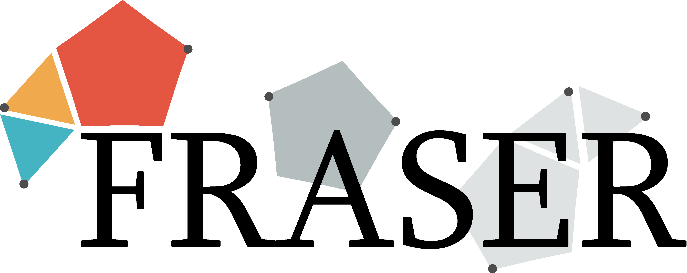

License
-------

Unless otherwise noted the source code is licensed under the
terms of the *Mozilla Public License, v. 2.0* (see mpl-v2.0.txt).

The following open source software is used:

 - ZeroMQ (licensed under LGPL V3)
 - Pugixml (licensed under MIT)

[German Aerospace Center (DLR)]: http://www.dlr.de/irs/en/